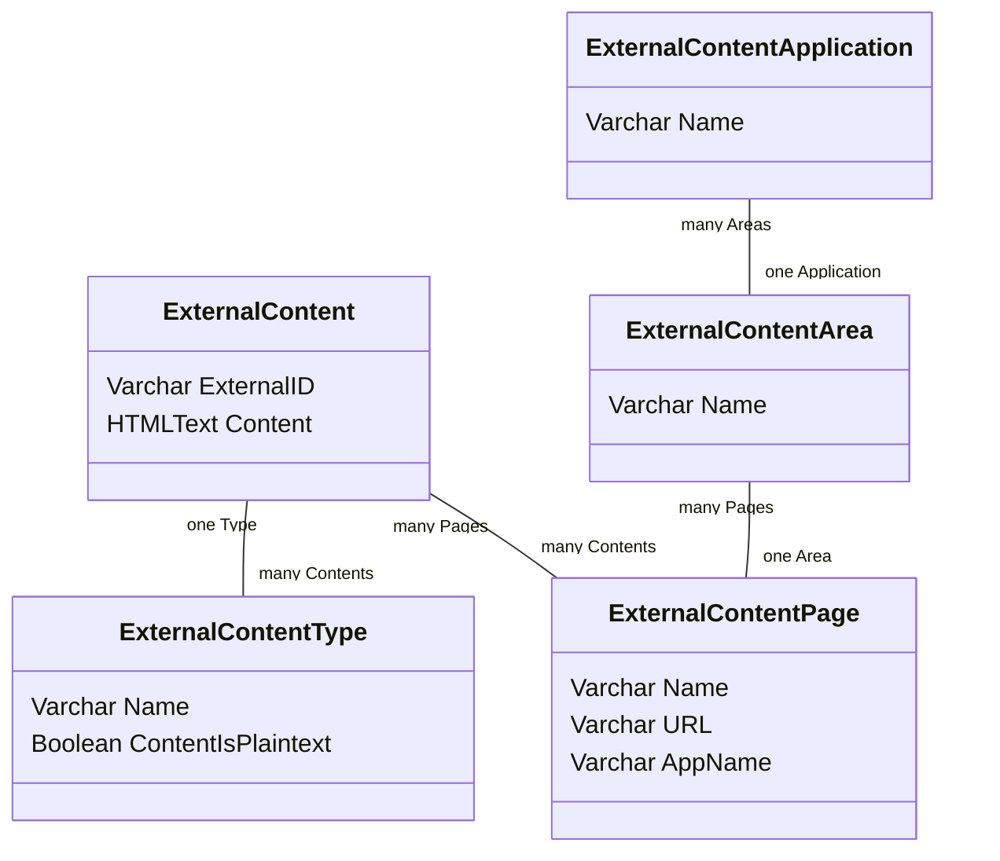

The external content API is a module designed to give Staff a CMS interface for writing messages for external tools, e.g. error messages, informational messages. The idea is that the external tool can be lightweight and leave the content management to a another tool designed for that purpose (SilverStripe CMS).

See [user guide](userguide.md)

There are five parts to this data & how it is managed

1. Content
2. Type
3. Application
4. Page
5. Area

Content is the literal content, the value of this piece of information. The type supplements it by letting the remote system know what the content is (HTML, text, number, etc.)

The latter three parts are a categorisation of the content in relation to the remote application that will serve the content. Many applications can be served through this API, all stored & manged within the same pool in the Silverstripe system, are filtered by request at "runtime".

E.g. (totally invented scenario)

**Application**: Registration fees payment  
**Page**: homepage  
**Area**: Page title  
**Type**: HTML  
**Content**: `<h1>Renew your vehicle registration online</h1>`  

**Application**: Registration fees payment  
**Page**: Payment form  
**Area**: Licence plate field error message  
**Type**: Text  
**Content**: `Please enter a valid NZ Licence plate - up to 6 alpha-numeric characters only`  

